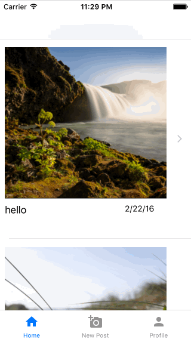

# Project 6 - *Gramify*

**Gramify** is a photo sharing app using Parse as its backend.

Time spent: **12** hours spent in total

## User Stories

The following **required** functionality is completed:

- [x] User can sign up to create a new account using Parse authentication
- [x] User can log in and log out of his or her account
- [x] The current signed in user is persisted across app restarts
- [x] User can take a photo, add a caption, and post it to "Instagram"
- [x] User can view the last 20 posts submitted to "Instagram"

The following **optional** features are implemented:

- [x] Show the username and creation time for each post
- [ ] When the user is uploading a photo, show a progress indicator to show how much of the photo has been uploaded
- [ ] User can connect his or her Facebook account
- [ ] User can comment on a post and see all comments for each post

The following **additional** features are implemented:

- [ ] List anything else that you can get done to improve the app functionality!

Please list two areas of the assignment you'd like to **discuss further with your peers** during the next class (examples include better ways to implement something, how to extend your app in certain ways, etc):

1. 
2. 

## Video Walkthrough 

Here's a walkthrough of implemented user stories:

GIF's created with [GifGrabber](https://itunes.apple.com/us/app/gifgrabber/id668208984?mt=12).

## Notes

Describe any challenges encountered while building the app.
- Got the flu
## License

    Copyright [yyyy] [name of copyright owner]

    Licensed under the Apache License, Version 2.0 (the "License");
    you may not use this file except in compliance with the License.
    You may obtain a copy of the License at

        http://www.apache.org/licenses/LICENSE-2.0

    Unless required by applicable law or agreed to in writing, software
    distributed under the License is distributed on an "AS IS" BASIS,
    WITHOUT WARRANTIES OR CONDITIONS OF ANY KIND, either express or implied.
    See the License for the specific language governing permissions and
    limitations under the License.
